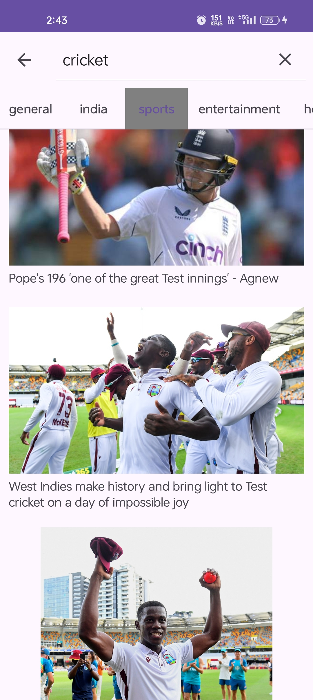

Hey i have build My News App Which is named RAJNews 
i use api "https://newsapi.org/"for this 
Here are some screenshot For this

You can get Top headlines of many categories . You can Search News by topic name and you can see the news in the webView

